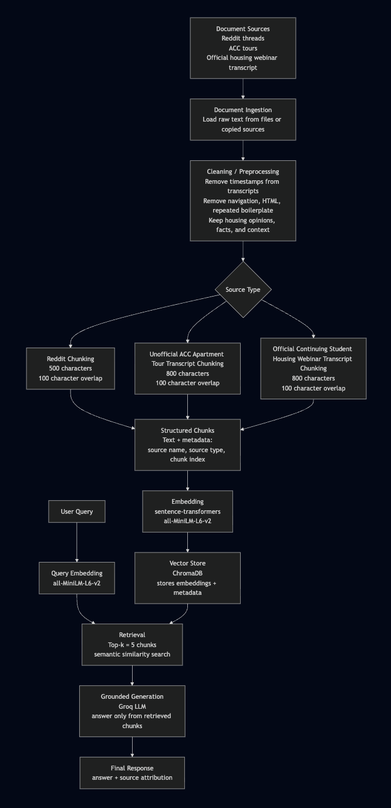

# Project 1 Planning: The Unofficial Guide

> Write this document before you write any pipeline code.
> Your spec and architecture diagram are what you'll use to direct AI tools (Claude, Copilot, etc.) to generate your implementation — the more specific they are, the more useful the generated code will be.
> Update the Retrieval Approach and Chunking Strategy sections if you change your approach during implementation.
> Update this file before starting any stretch features.

---

## Domain

<!-- What domain did you choose? Why is this knowledge valuable and hard to find through official channels? -->
My domain is continuing student housing navigation for students at UC Irvine. Oftentimes, official channels will merely list each option and a few key points about floor plans, distance from campus, cost, etc. However, they do not do critical comparison of each option, nor do they give students pros and cons of each option, which is where unofficial advice from other students comes in handy. This unofficial information is what will help students make a choice on what off-campus housing option to go with, based on their circumstances and the pros/cons of each option.

---

## Documents

<!-- List your specific sources: URLs, subreddit names, forum threads, or file descriptions.
     Aim for at least 10 sources that together cover different subtopics or perspectives within your domain. -->

| # | Source | Description | URL or location |
|---|--------|------|-----------------|
| 1 |r/UCI HOUSING MEGATHREAD (2022-2023)|Reddit megathread; general information and basic ranking|https://www.reddit.com/r/UCI/comments/vfp0la/uci_housing_megathread_20222023|
| 2 |r/UCI HOUSING MEGATHREAD (2023-2024)|Reddit megathread; more updated general information + ranking| https://www.reddit.com/r/UCI/comments/16cucqr/uci_housing_megathread_20232024/|
| 3 |r/Are the Acc apartments really that bad?|Reddit thread; potential issues with ACC housing|https://www.reddit.com/r/UCI/comments/14wks9z/are_the_acc_apartments_really_that_bad/|
| 4 |r/ACC vs off-campus housing advice|Reddit thread; financial aid coverage for ACC vs off-campus|https://www.reddit.com/r/UCI/comments/okh61o/acc_vs_offcampus_housing_advice/|
| 5 |r/I’ve heard bad things about ACC so far… Is off campus a better bet?|Reddit thread; ACC vs off-campus comparison|https://www.reddit.com/r/UCI/comments/xq3q8e/ive_heard_bad_things_about_acc_so_far_is_off/|
| 6 |r/Any ideas on Tackling off campus housing?|Reddit thread; ways to find off-campus housing|https://www.reddit.com/r/UCI/comments/1lygzfl/any_ideas_on_tackling_off_campus_housing/|
| 7 |r/What apartment communities don't suck?|Reddit thread; general ACC and off-campus housing advice|https://www.reddit.com/r/UCI/comments/1byxvg/what_apartment_communities_dont_suck/|
| 8 |r/Why choose ACC apartments over residence halls?|Reddit thread; ACC vs on-campus housing|https://www.reddit.com/r/UCI/comments/rtaopg/why_choose_acc_apartments_over_residence_halls/|
| 9 |UCI Housing Tour (Non-Dorms) - Pros and Cons Breakdown|YouTube video; overall ACC housing walkthrough|/Users/harinis/codepath/ai201/ai201-unofficial-guide/documents/uci_housing.txt|
| 10 |UC Irvine Student Housing Continuing Student Process Application Webinar 2026-2027|YouTube video; official continuing student housing guide|/Users/harinis/codepath/ai201/ai201-unofficial-guide/documents/uci_official_housing.txt|
---

## Chunking Strategy

<!-- How will you split documents into chunks?
     State your chunk size (in tokens or characters), overlap size, and explain why those
     numbers fit the structure of your documents.
     A review-heavy corpus warrants different chunking than a long FAQ. -->

**Chunk size:**
Reddit sources should be chunked by blank lines, but if a paragraph is longer than 500 characters, it will be split at 500 characters. There will be a 150-character overlap. The webinar transcript/ official housing information should use 500-character chunks with 150-character overlap. The Youtube tour will have 800 character chunking with 150 characters of overlap.

**Overlap:**
I will use 150 characters of overlap for all sources.

**Reasoning:**
In reddit threads, people write in small paragraphs of about 500 characters each, and each person has different points of view so I want to separate text from different people. In YouTube videos and official guides, information is more in depth and is not from multiple points of view, so 800 characters is needed to keep all the information without unnecessarily splitting it. 100 characters of overlap is to account for cutting a chunk mid sentence.

---

## Retrieval Approach

<!-- Which embedding model are you using (e.g., all-MiniLM-L6-v2 via sentence-transformers)?
     How many chunks will you retrieve per query (top-k)?
     If you were deploying this for real users and cost wasn't a constraint, what tradeoffs
     would you weigh in choosing a different embedding model — context length, multilingual
     support, accuracy on domain-specific text, latency? -->

**Embedding model:**
all-MiniLM-L6-v2 via sentence-transformers because it has no cost and runs locally without an API key, and it is good enough for a small project. After embedding, the vectors will be stored in ChromaDB.

**Top-k:**
top-k = 5 because this is a good balance between being concise and providing useful context.

**Production tradeoff reflection:**
If I were deploying this for real users, I would compare different embedding models primarily based on retrieval accuracy and latency. I would want the model to work at a reasonable speed and I would also want to ensure that it is as accurate as possible, because after all, students will be using it to decide where to spend money on housing. Multilingual support isn't as important as latency and accuracy because students are mostly familiar with English and all official sources are in English as well.

---

## Evaluation Plan

<!-- List your 5 test questions with their expected correct answers.
     Questions should be specific enough that you can judge whether the system's response
     is right or wrong. "What are good dining halls?" is too vague.
     "What do students say about wait times at [dining hall name] during lunch?" is testable. -->

| # | Question | Expected answer |
|---|----------|-----------------|
| 1 |Which ACC community is considered the nicest?|Plaza Verde (PV) is the newest community and is generally considered the nicest.|
| 2 |What should I consider before dorming a second year?|Dorming is generally more expensive than ACC or off-campus housing and mostly just first years live in the dorms, but it can be more convenient for late night on-campus events.|
| 3 |What do students say about Arroyo Vista?|There are mixed opinions. Arroyo Vista doesn't have a 12 month contract, there are no freshmen, and it is cheap, but is generally considered the worst housing option because of its noise issues and ant problems.
| 4 |What ACC community is the farthest from campus?|VDC is the farthest from campus.|
| 5 |Is Irvine Company a good option?|Some students have had a good experiences with it but others say that it is expensive and has bad reviews on Yelp.|

---

## Anticipated Challenges

<!-- What could go wrong? Name at least two specific risks with reasoning.
     Consider: noisy or inconsistent documents, missing source attribution, off-topic
     retrieval, chunks that split key information across boundaries. -->

1. Sometimes the meaning of a particular paragraph in a reddit thread changes based on having read the previous responses or not. Some responses might be misinterpretted or not make sense due to chunking, causing the AI to output inaccurate information.

2. Since most unoffical information on housing is opinionated, there will be conflicting and inconsistant information. This will cause unpredictable and inconsistant AI responses.

---

## Architecture

---

## AI Tool Plan

<!-- For each part of the pipeline below, describe:
     - Which AI tool you plan to use (Claude, Copilot, ChatGPT, etc.)
     - What you'll give it as input (which sections of this planning.md, which requirements)
     - What you expect it to produce
     - How you'll verify the output matches your spec

     "I'll use AI to help me code" is not a plan.
     "I'll give Claude my Chunking Strategy section and ask it to implement chunk_text()
     with my specified chunk size and overlap" is a plan. -->

1. Document ingestion and cleaning

I will give Claude my Documents section, my Chunking Strategy section, and examples of my raw source text, especially Reddit posts and YouTube/webinar transcripts. I will ask it to help implement functions that load text files, clean transcript timestamps, clean reddit commands such as "share" (non-information), remove extra whitespace, and preserve source metadata.

Expected output: Python helper functions such as load_documents(), clean_reddit_text(), clean_transcript_text(), and clean_official_page_text().

How I will verify it: I will print the cleaned version of several documents and manually check that timestamps, navigation text, and empty lines are removed while the actual housing information is preserved.

2. Chunking

I will give the Claude my Chunking Strategy section and ask it to implement chunking based on source type. Reddit sources should be chunked by blank line, but if a paragraph is longer than 500 characters, it will be split at 500 characters. There will be a 150-character overlap. The webinar transcript/ official housing information should use 500-character chunks with 150-character overlap. The Youtube tour will have 800 character chunking with 150 characters of overlap.

Expected output: A chunk_text() function that return chunks with metadata such as source name, source type, and chunk index.

How I will verify it: I will print at least 5 sample chunks from different source types and check that each chunk is readable, not empty, not full of junk text, and mostly understandable on its own.

3. Embedding and vector store

I will give Claude my Retrieval Approach section and pipeline diagram. I will ask it to help write code that embeds chunks using all-MiniLM-L6-v2 from sentence-transformers and stores the embeddings in ChromaDB with metadata.

Expected output: Python code that loads chunks, creates embeddings, stores them in ChromaDB, and allows the database to be queried.

How I will verify it: I will confirm that the number of stored chunks matches the number of generated chunks. I will also inspect returned metadata to make sure retrieved chunks still show the correct source document.

4. Retrieval testing

I will give Claude my Evaluation Plan questions and ask it to help create a small retrieval test script that prints the query, top-k returned chunks, source names, and distance scores.

Expected output: A function such as retrieve(query, top_k=5) and a script that runs my test questions.

How I will verify it: I will manually read the top returned chunks for at least 3 queries and look at whether they are relevant. If the top chunks are unrelated, I will adjust cleaning, chunking, or source metadata before moving to generation.

5. Grounded generation and interface

I will give Claude the project requirement that answers must use only retrieved chunks and include source attribution. I will ask it to help write a prompt template and a simple interface using Gradio or a command-line query script.

Expected output: A function such as ask(question) that retrieves chunks, sends only those chunks to the LLM, and returns an answer with visible sources.

How I will verify it: I will test normal questions and at least one out-of-scope question. The system should answer only when the retrieved chunks contain enough information. If the documents do not support the answer, the system should say it does not have enough information instead of guessing inaccurately.

**Milestone 3 — Ingestion and chunking:**

**Milestone 4 — Embedding and retrieval:**

**Milestone 5 — Generation and interface:**
